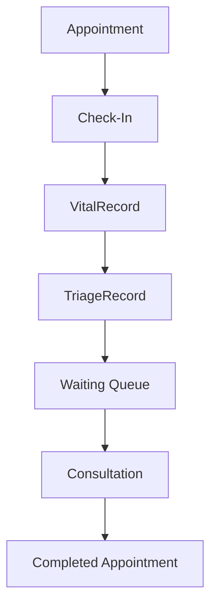

# Appointment Clinical Workflow

| Actor | Controlled transition |
|---|---|
| Nurse/Admin | `CONFIRMED → CHECKED_IN` |
| Nurse | `CHECKED_IN → TRIAGED → WAITING` |
| Assigned doctor | `WAITING → IN_CONSULTATION → COMPLETED` |

Transitions are conditional database updates, not arbitrary status patches. Hospital scope and doctor assignment are verified. Phase 5 cancellation remains unchanged. Patient self-check-in, automatic missed detection, and scheduled wait prediction are not implemented.
