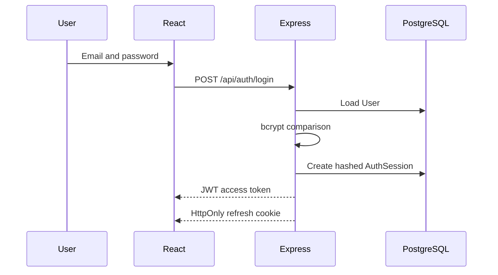
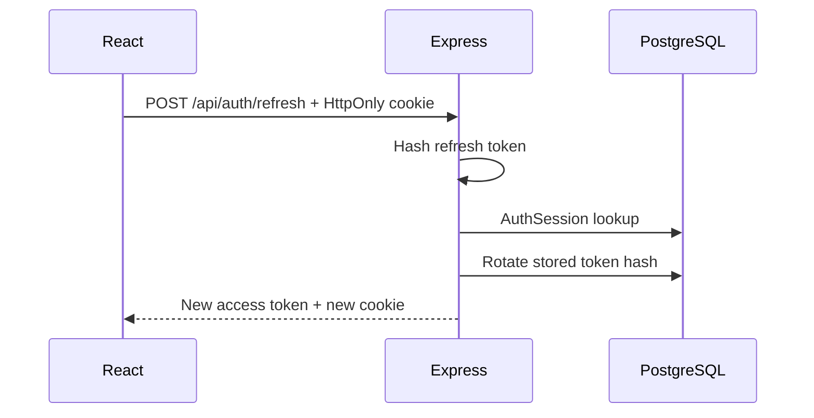
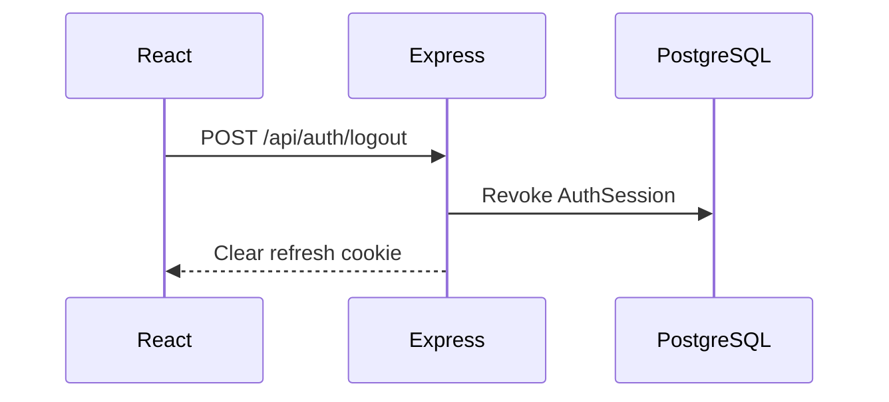

# Authentication and Session Security

## Architecture

PostgreSQL is the identity source of truth. Passwords are hashed with bcrypt (cost 12). A successful login returns a signed JWT access token with a 15-minute lifetime; the React client keeps it only in memory. A cryptographically random refresh token represents a seven-day `AuthSession`. Only its SHA-256 hash is stored in PostgreSQL, while the raw value is sent in an `HttpOnly` cookie.

The cookie is `HttpOnly`, `SameSite=Lax` in development (`Strict` in production), scoped to `/api/auth`, and `Secure` in production. Production must use HTTPS and an exact CORS allowlist. Access tokens contain only `sub`, `role`, `sessionId`, standard timing claims, issuer, and audience.

## Flows

- Public registration is transactionally restricted to `PATIENT`; it creates a `User`, `PatientProfile`, bcrypt hash, and audit record. It creates no hospital membership.
- Staff use the same login endpoint. Admin-controlled `/api/admin/doctors` and `/api/admin/nurses` derive the hospital from `AdminProfile` and create profiles/relationships transactionally.
- Refresh rotates the token hash in the existing session. Reusing the previous cookie fails because its hash no longer exists.
- Logout revokes the current session. Logout-all revokes all active sessions for the authenticated user.
- Password change verifies the current password, hashes the replacement, revokes other sessions, and rotates the current session.
- `User.active` is checked at login, refresh, and every authenticated request.
- Expired/revoked cleanup is exposed as a service helper; no scheduler is claimed in Phase 3.

## Abuse and disclosure controls

Successful logins are not limited. Only failed login responses count toward the temporary threshold of 10 failures per 15 minutes per process/IP. Successful registrations are not capped. Refresh remains limited to 30 requests per 15 minutes to protect session rotation. These development in-memory limits do not permanently lock accounts. Production should use a shared rate-limit store, reverse-proxy IP configuration, monitoring, and risk-based controls.

Passwords, hashes, raw refresh values, card numbers, and medical payloads are excluded from audit metadata. API serializers exclude `passwordHash` and `refreshTokenHash`; database/Prisma details are converted to safe errors. Unknown-email failures cannot be attached to the current `AuditLog` because its schema requires a valid user; infrastructure request logs should cover that production case without recording credentials.

## Test database strategy

`tests/authIntegration.test.js` uses uniquely named `.invalid` patient records in the configured development/test database and deletes only those exact sessions, audit rows, profile, and user after the suite. Production credentials must never be supplied to tests. A dedicated `DATABASE_URL` is recommended for CI.

The Prisma 6 `package.json#prisma` seed warning is retained to avoid a Phase 3 major upgrade. Migration to `prisma.config.ts` is future maintenance.
