# Database ERD

Phase 8.1 adds `NurseProfile ||--o{ NurseDepartment`, `Department ||--o{ NurseDepartment`, `NurseProfile ||--o{ NurseAppointmentAssignment`, and `Appointment ||--o{ NurseAppointmentAssignment`. CareSync uses one configured Hospital row.

This Mermaid diagram reflects the implemented Phase 2 Prisma schema. Attribute details and constraints are in `DATABASE_DESIGN.md`.

```mermaid
erDiagram
  User ||--o| AdminProfile : has
  User ||--o| PatientProfile : has
  User ||--o| DoctorProfile : has
  User ||--o| NurseProfile : has
  User ||--o{ Notification : receives
  User ||--o{ AuditLog : performs
  User ||--o{ VitalRecord : records

  Hospital ||--o{ AdminProfile : employs
  Hospital ||--o{ NurseProfile : employs
  Hospital ||--o{ Department : contains
  Hospital ||--o{ PatientHospitalRecord : registers
  Hospital ||--o{ PatientCard : issues_or_verifies
  Hospital ||--o{ DoctorHospital : affiliates
  Hospital ||--o{ DoctorDepartment : scopes
  Hospital ||--o{ DepartmentSchedule : schedules
  Hospital ||--o{ DoctorSchedule : schedules
  Hospital ||--o{ ScheduleException : records
  Hospital ||--o{ AppointmentSlot : offers
  Hospital ||--o{ Appointment : hosts
  Hospital ||--o{ VitalRecord : stores
  Hospital ||--o{ TriageRecord : stores
  Hospital ||--o{ SymptomAssessment : stores
  Hospital ||--o{ Consultation : stores
  Hospital ||--o{ Notification : contextualizes
  Hospital ||--o{ AuditLog : contextualizes

  PatientProfile ||--o{ PatientHospitalRecord : has
  PatientProfile ||--o{ PatientCard : submits
  PatientProfile ||--o{ Appointment : books
  PatientProfile ||--o{ VitalRecord : has
  PatientProfile ||--o{ TriageRecord : receives
  PatientProfile ||--o{ SymptomAssessment : receives
  PatientProfile ||--o{ Consultation : receives

  DoctorProfile ||--o{ DoctorHospital : joins
  DoctorProfile ||--o{ DoctorDepartment : assigned
  DoctorProfile ||--o{ DoctorSchedule : follows
  DoctorProfile ||--o{ ScheduleException : has
  DoctorProfile ||--o{ AppointmentSlot : serves
  DoctorProfile ||--o{ Appointment : attends
  DoctorProfile ||--o{ Consultation : conducts

  Department ||--o{ DepartmentSchedule : opens
  Department ||--o{ DoctorDepartment : assigns
  Department ||--o{ DoctorSchedule : hosts
  Department ||--o{ AppointmentSlot : offers
  Department ||--o{ Appointment : receives
  Department ||--o{ SymptomAssessment : recommended_for

  NurseProfile ||--o{ TriageRecord : records
  AdminProfile ||--o{ PatientCard : verifies
  AppointmentSlot o|--o{ Appointment : reserves
  PatientCard o|--o{ Appointment : supports
  Appointment ||--o{ VitalRecord : includes
  Appointment ||--o{ TriageRecord : includes
  Appointment o|--o{ SymptomAssessment : informed_by
  Appointment ||--o| Consultation : results_in
```

