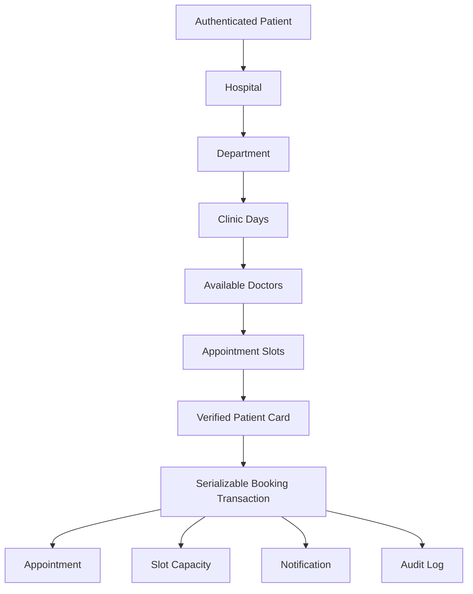

# Patient Booking — Phase 5

The authenticated patient selects a hospital, department, eligible clinic date, doctor/slot, verified card, and reason for visit. Clinic days, doctors, and slots come from PostgreSQL. The UI uses a 60-day search window; the server rejects past dates and revalidates every relationship and slot at confirmation.

Patient identity is derived from the authenticated `User`/`PatientProfile`; submitted patient IDs are not accepted. Phase 5 self-service prebooking requires an active `VERIFIED` Hospital Card or NHIS Card for the selected hospital. The selected slot determines hospital, department, doctor, date, time, and `PATIENT_PWA` booking method.

The transaction checks active relationships, capacity/status, card ownership, and overlapping patient appointments. Optimistic reservation plus serializable isolation prevents overbooking. The recommendation selects the earliest eligible real slot and uses workload as a tie-breaker; it is scheduling logic, not medical AI. The frontend disables repeat confirmation while pending; no idempotency-key protocol is claimed.

Patients may cancel or reschedule only their own future/current `PENDING` or `CONFIRMED` appointment. Checked-in or later clinical states, completed, cancelled, and missed appointments are ineligible. Cancellation releases capacity atomically. Rescheduling reserves the new slot and releases the old one in one transaction, preserving the old booking on failure. A legitimate first booking upserts the unique patient/hospital relationship.
