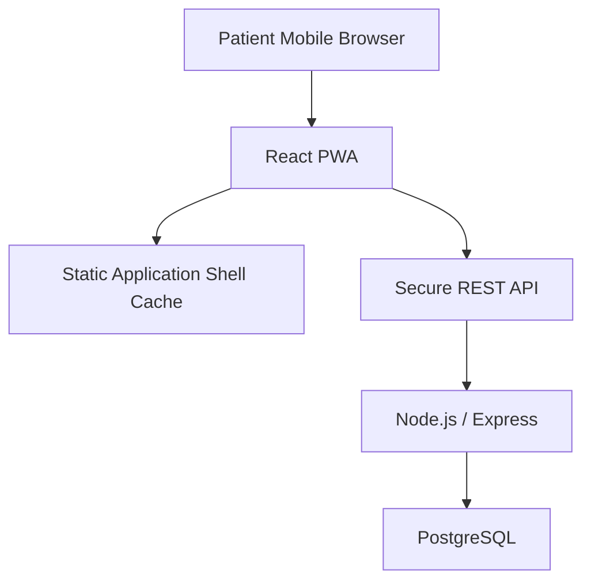

# Patient PWA Implementation

The existing React/Vite application is installable as **CareSync**. `manifest.webmanifest` defines standalone display, project colours, start URL, and original 192×192 and 512×512 icons. The patient layout supplies desktop navigation and a touch-friendly mobile bottom bar.

`public/sw.js` caches the entry shell, offline page, manifest, icons, and same-origin static assets. Every `/api/` request and non-GET request is explicitly **network only**. Appointments, cards, profile data, notifications, medical data, cookies, and tokens are not deliberately cached. Access tokens remain in memory and are not stored in localStorage.

Offline navigation falls back to the application shell or `offline.html`. A global offline banner makes clear that server-backed operations are unavailable. No sensitive offline drafts are stored. The landing-page sign-in form and patient portal expose an install control: supported Chromium browsers receive the native install prompt, iOS users receive Add to Home Screen instructions, already-installed applications show their installed state, and other browsers receive browser-menu guidance. Service-worker updates expose an update action and activate through `SKIP_WAITING`. Nginx serves the manifest with its manifest MIME type and prevents stale service-worker scripts. Browser/OS installation behaviour varies, and supported-browser DevTools/manual validation is still required; no Lighthouse score is claimed.
