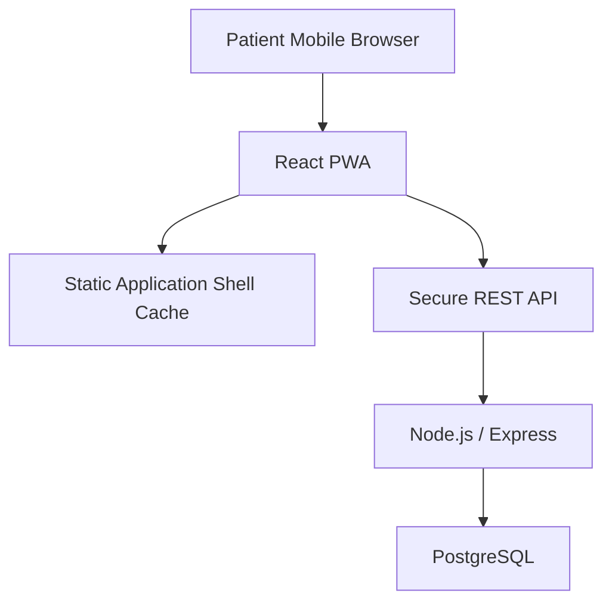

# Patient PWA Implementation

The existing React/Vite application is installable as **CareSync**. `manifest.webmanifest` defines standalone display, project colours, start URL, and original 192×192 and 512×512 icons. The patient layout supplies desktop navigation and a touch-friendly mobile bottom bar.

`public/sw.js` caches the entry shell, offline page, manifest, icons, and same-origin static assets. Every `/api/` request and non-GET request is explicitly **network only**. Appointments, cards, profile data, notifications, medical data, cookies, and tokens are not deliberately cached. Access tokens remain in memory and are not stored in localStorage.

Offline navigation falls back to the application shell or `offline.html`. The offline banner and forms make clear that booking/card operations require the server. No sensitive offline drafts are stored. `beforeinstallprompt` controls the optional install button, and service-worker updates raise a refresh prompt. Browser/OS installation behaviour varies, and supported-browser DevTools/manual validation is still required; no Lighthouse score is claimed.
