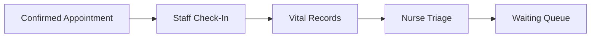

# Triage Workflow

Only an authenticated nurse in the appointment hospital creates/updates triage. Nurse identity and hospital come from the session. Check-in is available to own-hospital nurse/admin operational actors; clinical triage is nurse-only.

The nurse records chief complaint, notes, and clinician-selected `ROUTINE`, `LOW`, `MODERATE`, `HIGH`, or `EMERGENCY` urgency. Vital indicators may guide review but never choose urgency automatically. Saving triage moves `CHECKED_IN → TRIAGED`; a separate action moves `TRIAGED → WAITING`.

Queue order is Emergency, High, Moderate, Low, Routine; ties use earlier triage/check-in/appointment time. This is deterministic operational logic, not AI. Emergencies can change ordering, so no exact waiting-time promise is shown.
